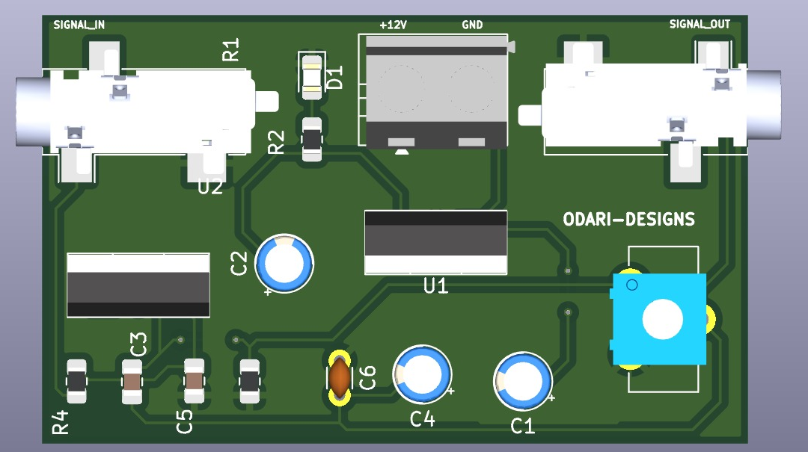

**NE5532 AUDIO AMPLIFIER PROJECT**

A compact stereo audio amplifier built around the NE5532 dual low-noise op-amp, designed for clean pre-amplification of line-level audio signals.

Ideal for hobbyists, DIY audio enthusiasts, and students learning analog circuit design and PCB layout using KiCad.

---

### OVERVIEW

This project demonstrates the design of a low-noise, high-fidelity preamplifier for audio applications using the NE5532 operational amplifier.

The circuit boosts small input signals (around 0.3 V) to a level suitable for driving power amplifiers, active speakers, or audio ADCs.

Main features include:

* Input and output jacks (3.5 mm or RCA)
* ±12 V regulated power supply
* Optional volume control
* Proper decoupling for low noise

---

### FEATURES

* Adjustable gain (typically 10×)
* Low noise (< 5 nV/√Hz)
* Powered by ±12 V regulated supply
* Stereo operation (left & right channels)
* Works with standard 3.5 mm jacks
* Designed in KiCad (THT or SMD components supported)

---

### BLOCK DIAGRAM

Audio Input → Coupling Capacitor → NE5532 Amplifier → Output Capacitor → Audio Output

        ↑

      Feedback Network

        ↓

      Gain Control

---

### POWER SUPPLY

The amplifier runs on a ±12 V dual supply for low distortion and good headroom.

You can generate it using:

1. Dual-output DC-DC converter (e.g., Murata NMA1212SC, RECOM RB-1212D, MeanWell DCWN03)
2. Linear regulators (LM7812 and LM7912) with a center-tapped transformer

Add 100 nF and 10 µF decoupling capacitors close to the op-amp power pins.

---

### TYPICAL CIRCUIT COMPONENTS

| Component | Typical Value        | Description                       |
| --------- | -------------------- | --------------------------------- |
| U1        | NE5532P              | Dual op-amp IC                    |
| R1, R3    | 10 kΩ               | Input resistors                   |
| R2, R4    | 100 kΩ              | Feedback resistors (gain ≈ 10×) |
| C1, C2    | 1 µF film           | Input coupling capacitors         |
| C3, C4    | 100 µF electrolytic | Output coupling capacitors        |
| C5–C8    | 100 nF               | Power decoupling capacitors       |
| VR1       | 10 kΩ log           | Volume potentiometer (optional)   |

---

### AUDIO JACK PINOUT

| Pin | Label                       | Function     |
| --- | --------------------------- | ------------ |
| T   | Tip                         | Audio signal |
| S   | Sleeve                      | Ground       |
| G   | Switch or detect (optional) |              |

For stereo 3.5 mm jacks:

Tip = Left  Ring = Right  Sleeve = Ground

---

### DESIGN NOTES

* Use **film capacitors** in the signal path for better sound.
* Keep input and output grounds separate from power ground (star grounding).
* Place **decoupling capacitors** very close to the NE5532 pins.
* Pin-compatible upgrade options:  **OPA2134** ,  **LM4562** , etc.

---

### TOOLS USED

* KiCad 8.0+ for schematic and PCB layout
* LTSpice or Falstad for simulation
* JLCPCB / PCBWay for fabrication
* GitHub for version control and documentation

---

### POWER CONNECTIONS

| Pin    | Description     |
| ------ | --------------- |
| +12 V  | Positive supply |
| GND    | Ground          |
| −12 V | Negative supply |

For modules like RB-1212D:

VIN+ → +12 V input

VIN− → GND

VOUT+ → +12 V output

VOUT− → −12 V output

COM → GND

---

### TESTING STEPS

1. Connect ±12 V supply.
2. Apply a 0.3 V RMS sine wave to the input.
3. Measure the output with a 10 kΩ load.
4. Expect output ≈ 3 V RMS (gain ≈ 10×).
5. Check waveform for clean, undistorted signal.

---

### PCB LAYOUT TIPS

* Keep audio traces short and away from power paths.
* Use a full ground plane.
* Separate analog ground from power ground.
* Label all connectors and mounting holes clearly.

---

### REPOSITORY STRUCTURE

NE5532_Audio_Amplifier

│

├── schematic → NE5532_Preamp.kicad_sch

├── pcb → NE5532_Preamp.kicad_pcb

├── docs → README.docx, wiring_diagram.png

├── simulations → NE5532_Preamp.asc

└── LICENSE

---

### LICENSE

This project is released under the  **MIT License** .

You may use, modify, and distribute it for personal or educational projects.

---

### ACKNOWLEDGEMENTS

* NE5532 Datasheet — Texas Instruments
* KiCad Open Source Community
* DIYAudio Forum Contributors

---

### FUTURE UPGRADES

* Add tone control (bass/treble)
* Integrate headphone driver (TPA6120, LM4881)
* Convert to full SMD version
* Optional balanced XLR input stage

---

**Clean, simple, analog sound — powered by the NE5532.**
